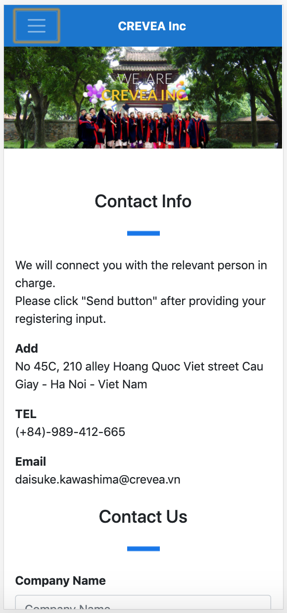
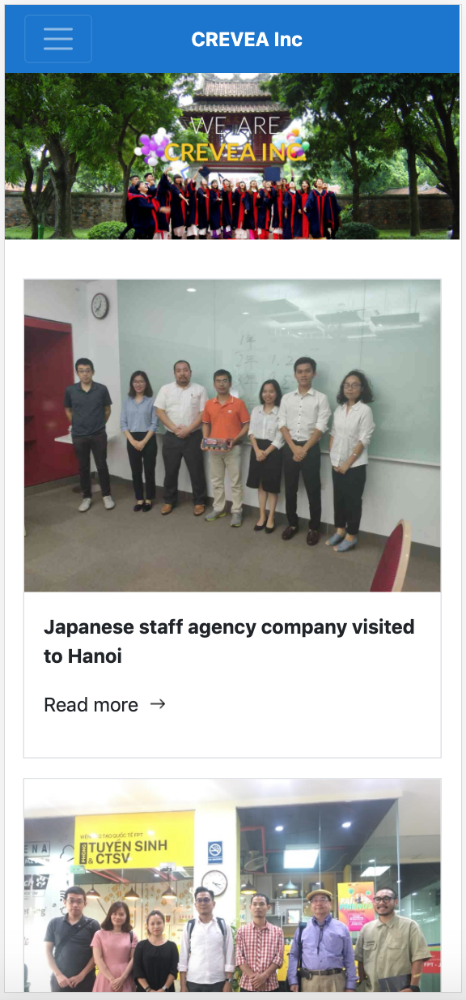
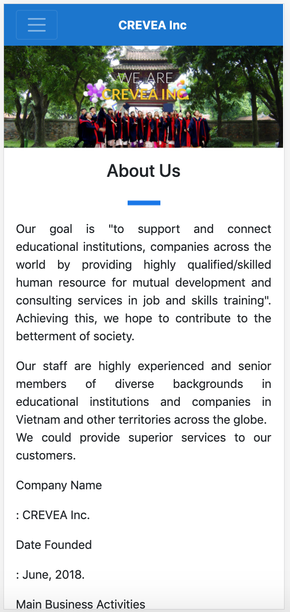
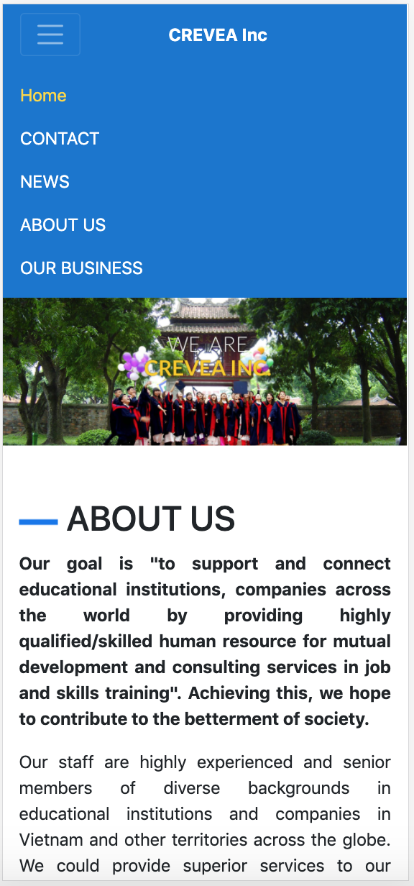

## Assignment 4

### Technical challenges
- Responsive website on 3 differents screen size: mobile, tablet, desktop.
- Implement menu button and collapse navigation bar for mobile screen size.
- Got issue with `col-sm-{size}` because it was deprecated from Bootstrap 4. Should use `col-{size}` for small screen size.
- Duplicate code of nav-bar and footer.

### Sitemap
Implemented 5 different responsive screens on mobile, tablet, desktop.

- [**Home**](https://ngominhtrint.github.io/index.html)
- [**Contact**](https://ngominhtrint.github.io/contact.html)
- [**News**](https://ngominhtrint.github.io/news.html)
- [**About Us**](https://ngominhtrint.github.io/aboutUs.html)
- [**Our Business**](https://ngominhtrint.github.io/ourBusiness.html)

### Deployment

Reference [this tutorial](https://pages.github.com/) to host project on github.io

### Apply SEO

- Add `<title>`.
- Add `<meta name="google-site-verification">`.
- Add keywords and description inside `<head>` tag.

```
<meta name="keywords"
    content="CREVEA Inc Education Consulting Jama Karle Hanoi Japanese Taiwanese Business daisuke kawashima">
  
<meta name="description"
    content="support and connect educational institutions, companies across
  the world by providing highly qualified/skilled human resource for mutual development and consulting services in job and skills training">
```

### Apply Google Analytics

```
<script async src="https://www.googletagmanager.com/gtag/js?id=UA-158975210-1"></script>

<script src="./gtag.js"></script>
```

### Walkthrough






